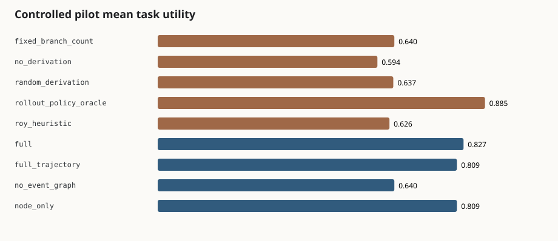

# Roy CS-GRPO controlled pilot

Date: 2026-08-15. This is a bounded local research/pipeline result, not an external benchmark claim.

## Scope

- 180 deterministic tasks: 90 train, 30 validation and 60 test.
- 60 tasks each for Activation, Acquisition and Mixed; 30 test tasks are OOD.
- Three branch specifications and two common-seed repeats per checkpoint.
- 1,560 versioned trajectory records.
- Frozen 384-dimensional `all-MiniLM-L6-v2` encoder at revision `c9745ed1d9f207416be6d2e6f8de32d1f16199bf`.
- Four learned ablations trained for 10 CPU epochs with seed `20260815`.

Generated datasets, traces and weights remain under `research/output/` and are excluded from Git. The committed report is sufficient to state what ran; reproduction regenerates the machine-readable artifacts.

## Results

| Arm | Test utility | Rollout-policy regret | Paired 95% CI vs no derivation | Paired 95% CI vs full |
| --- | ---: | ---: | --- | --- |
| No derivation | 0.5939 | 0.2908 | baseline | n/a |
| Fixed branch count | 0.6396 | 0.2450 | [-0.0588, 0.1552], inconclusive | n/a |
| Random derivation | 0.6368 | 0.2478 | [-0.0313, 0.1208], inconclusive | n/a |
| Current Roy heuristic | 0.6264 | 0.2582 | [-0.0696, 0.1385], inconclusive | n/a |
| Full-trajectory GRPO | 0.8086 | 0.0760 | [0.1534, 0.2771], positive | [-0.0257, -0.0113], negative |
| CS-GRPO without event graph | 0.6396 | 0.2450 | [-0.0588, 0.1552], inconclusive | [-0.2335, -0.1384], negative |
| Node-only CS-GRPO | 0.8086 | 0.0760 | [0.1534, 0.2771], positive | [-0.0257, -0.0113], negative |
| Full hierarchical V0-V4 | 0.8266 | 0.0580 | [0.1685, 0.2977], positive | baseline, inconclusive |
| Fixed-rollout joint oracle diagnostic | 0.8846 | 0.0000 | [0.2252, 0.3586], positive | n/a |



Full-policy decision accuracy was 0.8833. OOD utility/regret was 0.7975/0.0850 across 30 examples. The gap between full and Node-only came from conditional child-specification selection; the event-graph ablation collapsed to the fixed-branch behavior.

Mechanism diagnostics reconstructed exactly: maximum telescoping error was 0.0, mean `G_acq` was 0.3013 and mean `G_act` was 0.4606. Mean event-graph size was 5.0 nodes and 0.67 communication edges; mean work/span was 8.67/2.0.

## Failure cases

The five largest fixed-rollout regrets all selected `BRANCH` when the joint oracle selected `RETURN`, with regret from 0.3257 to 0.4568. This indicates under-training of terminal readiness in the small pilot and remains a primary target for calibration. The OOD branch permutation also reduced child-selection quality, as intended by the split.

## Live and external status

The initial 175-token `deepseek-v4-flash` connectivity smoke has now been followed by a nine-checkpoint real-rollout pilot. The final slice used 66 provider requests and 25,880 tokens; its generated data trained all four learned variants end to end. Results were tied with no derivation on three held-out tasks and are inconclusive. See [the live pilot report](live-deepseek-pilot.md). No raw response, credential or API artifact is committed.

The tau Knowledge/TUA-Bench 120-episode matrix was packaged and dry-run locally. Full benchmark assets and episodes were not executed because no separate high-capacity remote host was supplied. The runner pins both repository revisions, records container image digests during preparation, forwards arm configuration, and places all DeepSeek calls behind the persistent hard-budget proxy. It fails closed until the host confirms that both framework-specific agents consume the Roy arm hooks, preventing mislabeled identical-arm runs.

## Reproduce

```bash
npm run research:test
PYTHONPATH=research python3 -m roy_research generate --output research/output/full/tasks.jsonl
PYTHONPATH=research python3 -m roy_research collect --tasks research/output/full/tasks.jsonl --output research/output/full/groups.jsonl --traces research/output/full/traces.jsonl --repeats 2
PYTHONPATH=research python3 -m roy_research experiment --groups research/output/full/groups.jsonl --output research/output/full/experiment --epochs 10 --device cpu
```
